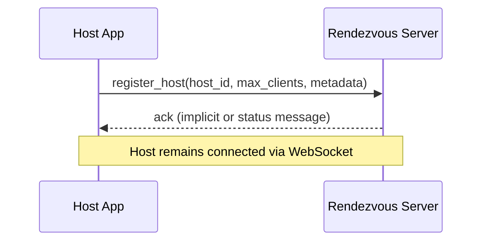
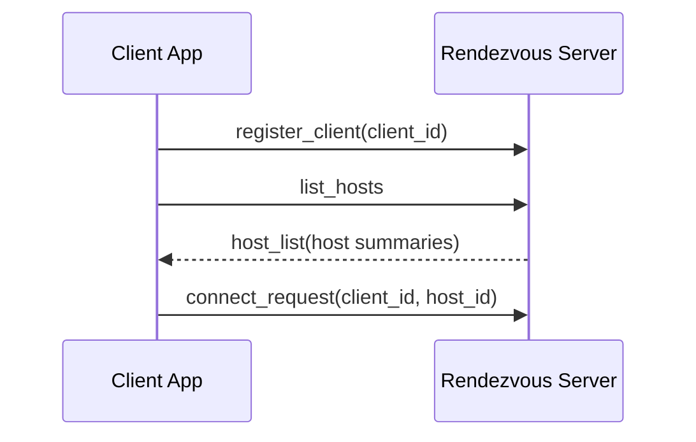
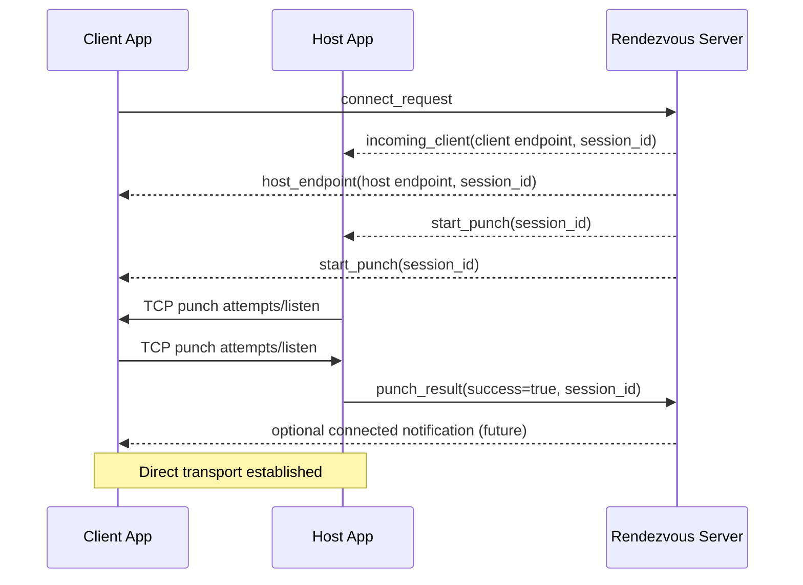
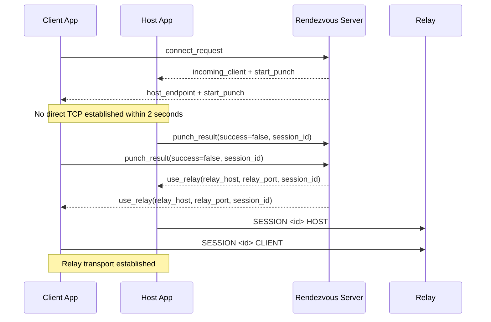
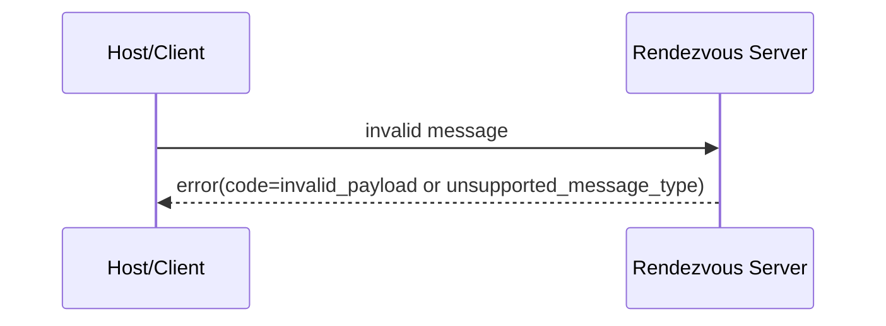

# Phase 0 Sequence Flows

## 1. Host Register and Stay Online

## 2. Client List Hosts and Connect Request

## 3. Punch Success Path

## 4. Punch Timeout to Relay Fallback

## 5. Error Flow for Invalid Message

